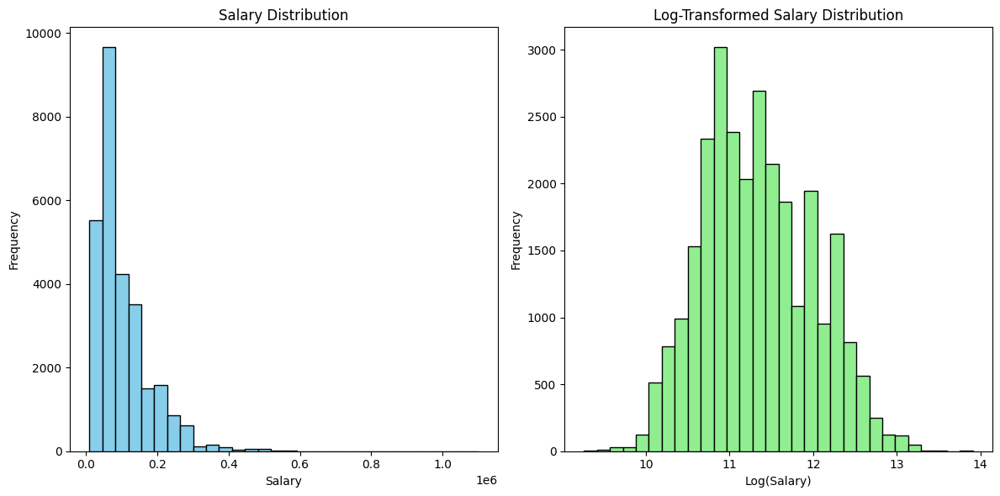

# Описание построения бейзлайна и мотивация выбора метрик
## Введение
В данном проекте выполняется анализ данных о вакансиях в IT-сфере с целью предсказания зарплат. Мы используем данные, загруженные из CSV-файла, и применяем различные методы обработки и анализа данных, включая категoризацию вакансий и построение линейной регрессии. 

## Построение бейзлайна
### 1. Загрузка и обработка данных
Данные взяты из CSV-файла и обработаны:
- Извлечена информация о регионах и странах с помощью рекурсивных функций.
- Добавлены новые столбцы, заполняемые на основе идентификаторов регионов.
- Удалены вакансии с неправдоподобно низкими зарплатами (менее 10 000 рублей) для повышения качества предсказаний.

### 2. Категоризация вакансий
Вакансии классифицированы по ключевым словам, что позволяет выделить различные области и роли. 

### 3. Обработка зарплат
В процессе обработки данных вычислены средняя и медианная зарплата по вакансиям, и добавлен новый столбец `salary`. Для предсказания зарплат использованы как среднее, так и медианное значения.

### 4. Логарифмирование зарплат
Для улучшения работы линейных моделей логарифмирована зарплата, создан новый столбец `log_salary`. Это позволяет нашей модели более эффективно обучаться, особенно если данные имеют скошенное распределение.

### 5. Разделение данных
Данные разделили на обучающую и тестовую выборки с использованием функции ‘train_test_split’. 

### 6. Обучение модели
В качестве бейзлайнов используются `среднее`, `медиана` и `простая линейная регрессия на малоинформативных вещественных признаках`. Модель обучена как на логарифмированных, так и на исходных значениях зарплат. Результаты работы модели оценены с использованием выбранных метрик.

## Оценка качества предсказаний
### 1. Предсказания на основе среднего и медианы
- **Среднее**:
  - MAPE: 78.10%
  - Доля близко угаданных зарплат: 10.16%
  
- **Медиана**:
  - MAPE: 56.76%
  - Доля близко угаданных зарплат: 8.89%	

### 2. Линейная регрессия по логарифмированному таргету
- MAPE: 55.49%
- Доля близко угаданных зарплат: 11.09%

### 3. Линейная регрессия по исходному таргету
- MAPE: 72.95%
- Доля близко угаданных зарплат: 10.44%

### Выводы
- Использование логарифмирования целевой переменной значительно улучшает качество предсказаний для линейной регрессии.
- Медиана дает более стабильные результаты, однако в некоторых случаях использование среднего может быть оправдано.
- Результаты показывают, что линейная регрессия, обученная на логарифмированных данных, демонстрирует лучшие показатели по MAPE и доле близко угаданных зарплат.

## Мотивация выбора метрик

Для оценки качества предсказаний были выбраны следующие метрики:

### 1. MAPE (Mean Absolute Percentage Error)

- **Причина выбора**: MAPE позволяет оценить относительную ошибку предсказаний, что особенно важно в контексте зарплат. Ошибка в 10,000 рублей при зарплате 50,000 рублей воспринимается иначе, чем при зарплате 500,000 рублей. MAPE учитывает это различие, предоставляя процентное значение ошибки.
- **Преимущества**:
  - Не симметричная метрика, что позволяет штрафовать перепрогнозы сильнее, чем недопрогнозы.
  - Устойчивость к выбросам, так как маленькие неправдоподобные значения были предварительно отфильтрованы.

### 2. Доля предсказаний в интервале n% от реального таргета

- **Причина выбора**: Эта метрика позволяет оценить, в какой доле случаев модель делает предсказания, находящиеся в разумных пределах от истинных значений. Это важно для пользователей, которые хотят быть уверены в точности прогнозов.
- **Преимущества**:
  - Позволяет оценить качество модели не только в среднем, но и в конкретных случаях, что важно для практического применения.

П.с.
1. Чем меньше MAPE, тем лучше (ошибка)
2. Чем выше доля предсказаний в интервале, тем лучше (точность)

## Заключение

В данной части проекта мы построили бейзлайны с использованием `среднего`, `медианы` и `линейной регрессии на малоинформативных вещественных признаках`, выбрали метрики, которые позволяют адекватно оценить качество предсказаний. Результаты показали, что логарифмирование целевой переменной и использование линейной регрессии по логарифмированному таргету значительно улучшает качество предсказаний. В дальнейшем планируем улучшить качество работы модели, добавив обработку информативных категориальных переменных, реализовать серверную и клиентскую части проекта.

